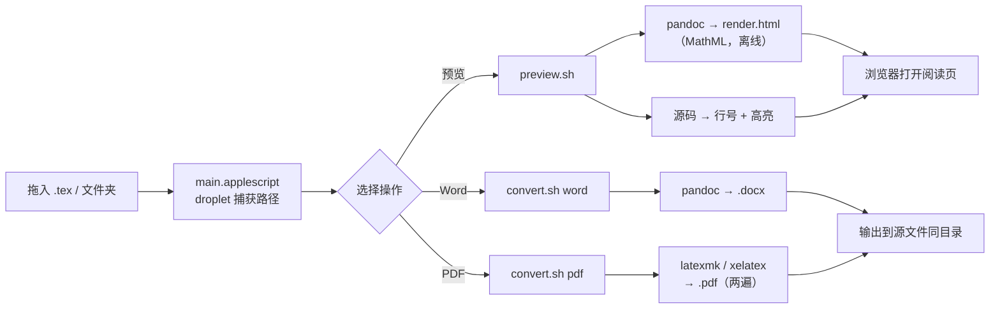

# LaTeX 转换 · LaTeX → PDF / Word ＋ TeX 阅览

一个 macOS 上的「**拖拽即用**」小工具：把 `.tex` 文件（或整个包含 `.tex` 的工程文件夹）拖到 App 图标上，选择操作即可。

- **预览** —— 在浏览器里打开阅读页，双标签：**排版预览**（pandoc 渲染 + MathML 公式，离线可用）／**源码**（带行号与语法高亮）
- **PDF** —— 调用本地 LaTeX 引擎编译（默认编译两遍，保证目录 / 交叉引用正确）
- **Word** —— 用 [pandoc](https://pandoc.org/) 转成 `.docx`

无需打开终端、无需记命令：既能**直接读** `.tex`，也能一键导出成可交付文件。

---

## 目录结构

```
latex-convert/
├── src/
│   ├── main.applescript      # 前端：AppleScript droplet（拖拽 + 选择操作）
│   ├── convert.sh            # 引擎：转 PDF / Word
│   └── preview.sh            # 引擎：TeX 阅览（生成自我包含的 HTML 阅读页）
├── scripts/
│   ├── make_icon.py          # 生成 App 图标（Pillow → .iconset → .icns）
│   └── build_app.sh          # 一键把源码打包成 “LaTeX 转换.app”
├── icon/
│   └── AppIcon.icns          # 预生成的图标
├── examples/
│   ├── demo.tex              # 最小示例（零额外宏包，任何 TeX 发行版都能编译）
│   └── demo-zh.tex           # 中文示例（依赖 ctex，需 xelatex）
├── LICENSE
└── README.md
```

---

## 安装依赖

| 用途 | 依赖 | 安装命令 |
|---|---|---|
| 转 Word | pandoc | `brew install pandoc` |
| 转 PDF（轻量） | BasicTeX | `brew install --cask basictex` |
| 转 PDF（完整） | MacTeX | `brew install --cask mactex` |
| 仅构建图标 | Python + Pillow | `pip install pillow --break-system-packages` |

> BasicTeX 体积小（约 100 MB），但只带常用宏包；若你的文稿用到 `ctex`、`xeCJK`、`enumitem` 等，
> 需要额外安装：
> ```bash
> sudo tlmgr update --self
> sudo tlmgr install ctex xeCJK enumitem lastpage multirow needspace xurl
> ```
> MacTeX 体积大（数 GB）但宏包齐全，一次到位。

---

## 使用

### 方式一：构建并使用 App（推荐）

```bash
git clone git@github.com:boff868/latex-convert.git
cd latex-convert
bash scripts/build_app.sh          # 产物：dist/LaTeX 转换.app
open dist                          # 在 Finder 中打开，把 .app 拖到「应用程序」
```

然后把 `.tex` 文件（或工程文件夹）拖到 App 图标上，弹框选择 **预览 / PDF / Word** 即可。
转换结果与源 `.tex` 位于同一目录；预览页会在浏览器中打开。

> 首次运行若提示「无法验证开发者」：在「系统设置 → 隐私与安全性」里点「仍要打开」，
> 或右键图标选择「打开」。构建脚本已做临时签名，通常不会触发。

### 方式二：只用命令行引擎

`src/convert.sh` 与 `src/preview.sh` 都是独立可用的 CLI：

```bash
chmod +x src/convert.sh src/preview.sh

# —— 转换 ——
./src/convert.sh word  examples/demo.tex          # 只转 Word
./src/convert.sh pdf   examples/demo.tex          # 只转 PDF
./src/convert.sh both  examples/demo.tex          # 两个都要
./src/convert.sh both  ./my-paper/                # 传文件夹：递归转换其中所有 .tex

# —— 阅览（浏览器打开阅读页）——
./src/preview.sh examples/demo.tex                # 单个文件
./src/preview.sh ./my-paper/                      # 整个工程
```

阅读页里：点上方标签或按 `1` / `2` 在「排版预览」与「源码」之间切换。

`examples/demo.tex` 是最小示例，装好任意 TeX 发行版即可编译；
`examples/demo-zh.tex` 演示中文排版，需要 `ctex` 宏包与 `xelatex`。

---

## 工作原理



三层结构，各管一件事：

1. **前端 `src/main.applescript`**
   - `on open theItems` 是 droplet 的入口，Finder 拖拽的文件会以 `alias` 列表传进来；
   - 统一用 `POSIX path of` 转成 shell 能用的路径；
   - 弹框让用户选操作（`display dialog` 最多 3 个按钮，所以取消用 Esc 实现），
     然后把路径用 `quoted form of` 逐个消毒，拼成参数串；
   - 通过 `do shell script` 调用 App 包内 `Contents/Resources/` 下的脚本，
     并把超时放宽到 3600 秒（大文档编译很慢，默认 2 分钟不够）；
   - 最后把引擎返回的文字用 `display dialog` 展示给用户。

2. **转换引擎 `src/convert.sh`**
   - 先把 `PATH` 手动补上 Homebrew 与 TeX 的常见位置（`/opt/homebrew/bin`、`/Library/TeX/texbin` 等）——
     因为从 Finder 启动的 App 拿到的是**极简 PATH**，不加这一步会找不到 `pandoc` / `xelatex`；
   - 收集目标：文件夹会 `find ... -name '*.tex'` 递归展开；
   - 依赖自查：要 Word 才检查 pandoc，要 PDF 才按
     `latexmk → xelatex → pdflatex → lualatex` 的顺序挑引擎，并给出可操作的安装提示；
   - PDF 编译：有 `latexmk` 就用它（自动处理多次编译），否则手动跑两遍；
   - 出错信息全部重定向到源目录下的隐藏文件 `.texconvert.log`，不污染终端输出；
   - 最后汇总「成功 / 失败」清单。

3. **阅览引擎 `src/preview.sh`**（详见下一节）

4. **图标 `scripts/make_icon.py`**
   - 用 Pillow 画一个圆角渐变方块 + `TeX` 字样；
   - 缩放导出全套尺寸到 `AppIcon.iconset`；
   - 调 macOS 自带的 `iconutil -c icns` 打包成 `.icns`。

`scripts/build_app.sh` 把上面各部分组装成标准 `.app` 包：
`osacompile` 编译 AppleScript 成 droplet → 塞入 `convert.sh`、`preview.sh` 与 `.icns`
→ 用 `PlistBuddy` 写 `Info.plist` → 临时签名。

---

## TeX 阅览是怎么做的

目标是「不装编辑器、不编译，也能舒服地读 `.tex`」，所以做成了一个**双视图 HTML 阅读页**，
生成在系统临时目录（`$TMPDIR/latex-preview/`），不污染工程目录。

**视图一 · 排版预览** —— 交给 pandoc：

```bash
pandoc foo.tex -s --mathml --embed-resources -o render.html
```

- `--mathml`：公式转成 MathML，**不依赖 MathJax CDN**，断网也能正常显示；
- `--embed-resources`：图片等资源以 base64 内嵌，HTML 挪到任何位置都不会丢图；
- 阅读页用 `<iframe>` 嵌这个 `render.html`，样式与源码视图互不干扰。

**视图二 · 源码** —— 自己拼：

- 用 `sed` 把 `&`、`<`、`>` 转义后塞进 `<pre>`，避免 HTML 注入；
- 页面里的原生 JS 读 `textContent` 拿回**未转义**的原文，按行切分后加行号 `span`；
- 再用一条正则给 LaTeX 语法上色：

  ```js
  /(%[^\n]*)|(\\begin\{[^}]*\}|\\end\{[^}]*\})|(\\[a-zA-Z@]+\*?|\\.)|(\$\$[\s\S]*?\$\$|\$[^$\n]*\$)|([{}])/g
  ```

  依次匹配 注释 → 环境 → 控制序列 → 数学 → 花括号，命中即套一个带颜色的 `<span>`。

**降级策略**：完全没装 pandoc 时，「排版预览」标签页显示一行提示，
「源码」视图照常可用；`render.log` 里保留 pandoc 的报错便于排查。

**快捷键**：`1` 看排版，`2` 看源码。

---

## 常见问题

**Q: 拖进去没反应 / 弹「找不到 pandoc」。**
从 Finder 启动的 App 环境变量极少。`convert.sh` 已内置 `export PATH=...`，
若你的工具装在别处，改这一行即可。

**Q: PDF 编译失败。**
看源 `.tex` 同目录下的 `.texconvert.log`，里面是完整的 LaTeX 报错。
中文文稿请确保用 `xelatex` 编译并加载了 `ctex`。

**Q: Word 里公式/图片错位。**
pandoc 的 LaTeX→docx 转换对复杂排版支持有限，这是 pandoc 本身的限制，
可以配合 `--reference-doc=模板.docx` 调整样式。

**Q: 想同时要 PDF 和 Word？**
App 里是单选（`display dialog` 最多 3 个按钮）；命令行用 `convert.sh both`。

**Q: 预览页面里「排版预览」是空的 / 显示一行提示？**
说明 pandoc 渲染失败（多半是没装 pandoc，或文稿用到了 pandoc 不认识的宏包）。
点上方「源码」标签页即可阅读原文；想排查可看临时目录里的 `render.log`，
或在终端手动跑一次 `pandoc 你的文件.tex -s --mathml --embed-resources -o /tmp/x.html` 看报错。

**Q: 预览会改动我的文件吗？**
不会。阅读页全部生成在系统临时目录（`$TMPDIR/latex-preview/`），源 `.tex` 只读不动。

**Q: 能像 PDF 那样在 Finder 里按空格预览 `.tex` 吗？**
那需要独立的 Quick Look 扩展（Swift + `.appex`），目前没有做；
现在的方案是拖到 App 上点「预览」，会直接在浏览器里打开阅读页。

**Q: 预览页的源码高亮能改配色吗？**
可以。`preview.sh` 里 `:root` / `@media (prefers-color-scheme: dark)` 两组 CSS 变量
（`--c-com` 注释、`--c-cmd` 控制序列、`--c-env` 环境、`--c-math` 公式）就是配色表，
自带浅色/深色两套，跟随系统。

---

## License

[MIT](LICENSE) © 2026 boff868
